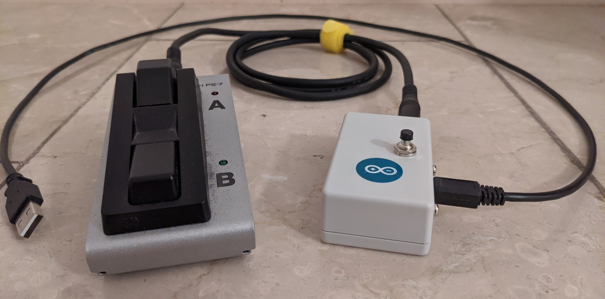
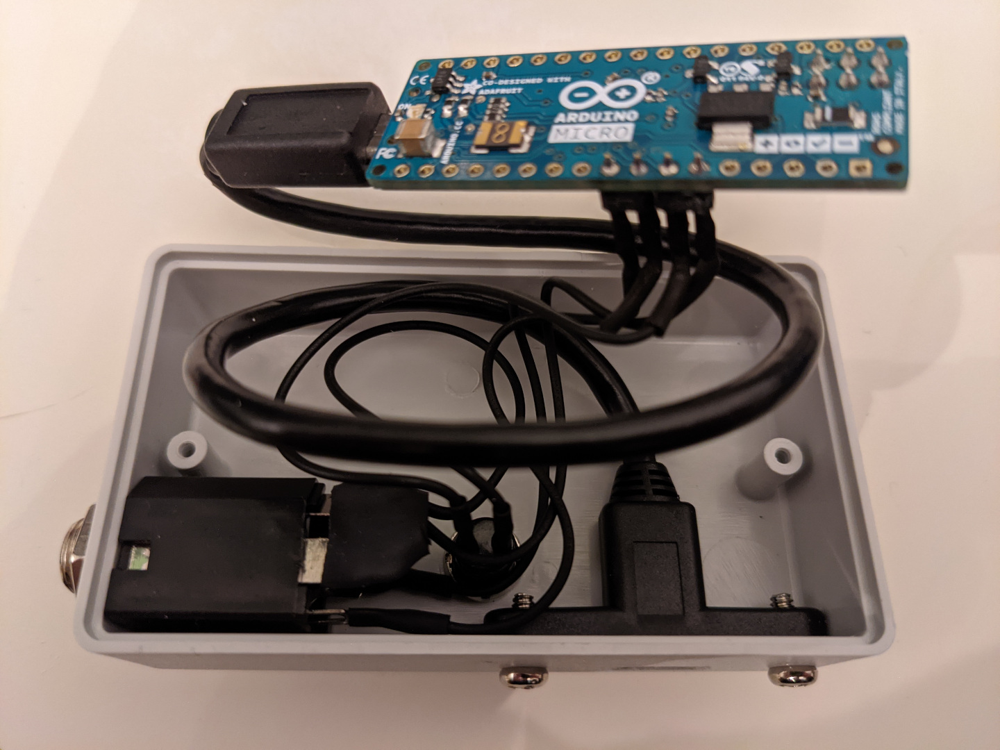

# Arduino Pageturner

This pageturner connects to a standard dual footswitch - via 6,3mm (1/4-inch) TRS connectors - and a PC using a micro-USB cable.

I use a Boss FS-7 Footswitch, which requires no batteries nor external power supply when used with the pageturner.

The pageturner also works with my Android phone using an USB adapter.

## Components

- Arduino Micro
- Pushbutton
- TRS Socket
- 10 kΩ Resistor
- TRS Patch Cable
- 2 Button Footswitch with TRS Socket

## Features

- Pushbutton switches modes. While holding it, other inputs change settings.
- Selected mode and settings are stored in the eeprom.
- Onboard LED indicates the selected mode (1-4)
- Serial console with debug output is enabled when the mode button is pressed on startup.

### Modes

1. Keyboard: Up Arrow / Down Arrow
1. Keyboard: Page Up / Page Down
1. Mouse: Scroll Up / Scroll Down
1. Media: Volume Up / Volume Down / Volume Mute

### Settings

settings can be changed by triggering inputs while holding the mode button:

- Repeat interval change (50ms, 150ms, 500ms)
- TRS input swap (Tip/Ring)
- TRS polarity toggle (Action on low / Action on high)

## Wiring

| Component | Pin |
|-|-|
| Mode Button | 2 |
| Mode Button Ground | Ground |
| Jack Tip | 4 (= Analog 6) |
| Jack Ring | 3 |
| Jack Sleeve | Ground |
| Jack Switch | Ground (Jack Sleeve) via Resistor |

The switch contact of the TRS socket is connected to ground via a resistor. When the jack is unplugged, the tip contact gets connected to the switch contact. In this configuration, a `digitalRead` on the pin connected to the tip contact returns LOW, but an `analogRead` on the same pin is able to detect the slightly higher voltage from the division of the internal pull-up resistor of 20-50 kΩ, and the external resistor of 10 kΩ.
The constant `inputJackTipAnalogThreshold` defines the threshold voltage (10 Bit resolution for 5V) which must be exceeded to detect the unplugged state.

## Housing

I put all the components into a small case (dimensions: 80 x 46 x 26 mm) and included a small micro-USB extension cable so there is no stress on the Arduino's USB socket. Using a slightly bigger case is probably not a bad idea...

## Usage

### Plugged

When the TRS Jack is plugged, following actions are available:

| Input | Action |
|-|-|
| Tip | Keypress / Mouse Wheel / Media Volume |
| Ring | Keypress / Mouse Wheel / Media Volume |
| Tip + Ring | Media Mute (Mode 4 only) |
| Mode | Mode change |
| Mode + Tip | TRS input swap |
| Mode + Ring | Repeat interval change |
| Mode + Tip + Ring | TRS polarity toggle |

### Unplugged

When the TRS Jack is unplugged, the mode button triggers 'Down Arrow' key presses.
